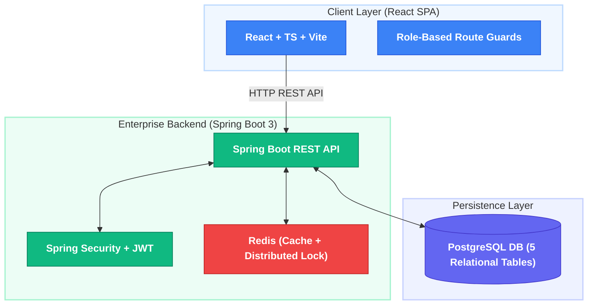
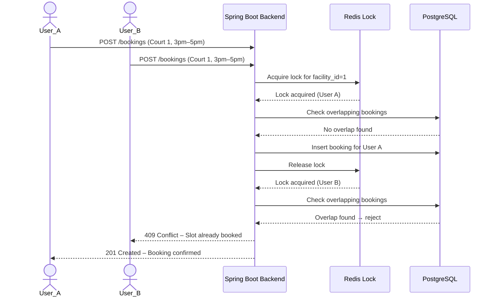
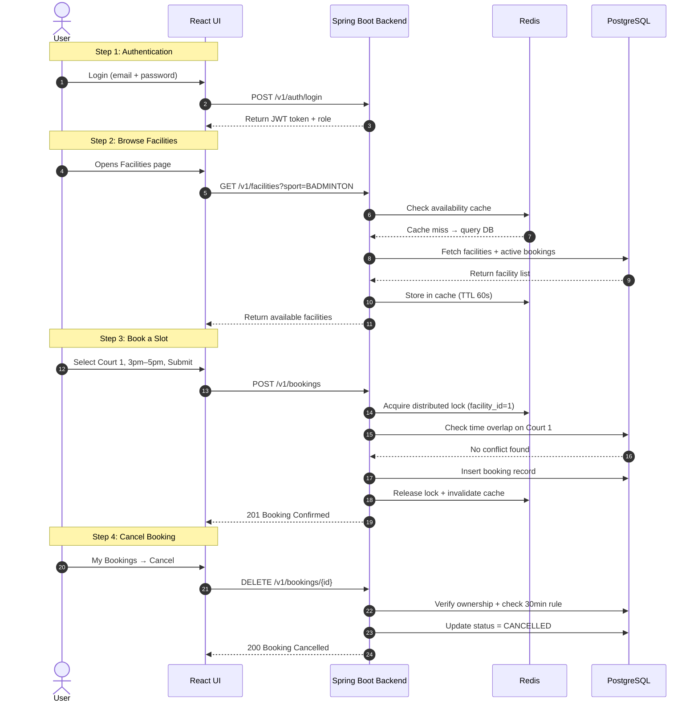

# SportZone – Multi-Sport Facility Booking Platform

**SportZone** is a full-stack sports facility booking platform for a multi-sport complex. Users can browse available facilities across 6 sports, book time slots with flexible start and end times, and manage their bookings. Admins manage facilities, view all bookings, and block slots for maintenance.

> Built using **Java 21**, **Spring Boot 3**, **PostgreSQL 16**, **Redis**, and **React SPA (TypeScript + Vite + Tailwind CSS)**.

     

---

## 🏛 System Architecture



### Stack Components:
- **React SPA**: Minimal dashboard with role-customized views, facility browsing, slot booking, and booking management.
- **Spring Boot 3 Backend**: Core engine handling JWT authentication, booking logic, concurrency control, and REST APIs.
- **PostgreSQL 16**: Relational storage for 5 core tables (`users`, `sports`, `facilities`, `bookings`, `blocked_slots`).
- **Redis**: Dual purpose — distributed locking for concurrent booking prevention, and caching facility availability queries.

---

## 🏟 The Sports Complex

| Sport | Facility Type | Units Available |
|---|---|---|
| Badminton | Courts | 4 courts |
| Cricket | Nets | 3 nets |
| Football | Grounds | 2 grounds |
| Swimming | Lanes | 6 lanes |
| Table Tennis | Tables | 5 tables |
| Pickleball | Courts | 3 courts |

---

## 🌟 Core Modules

| Module | Feature | Capability Description |
|---|---|---|
| **Module 1** | **Authentication** | JWT-based login and registration with BCrypt password encoding. |
| **Module 2** | **Facility Management** | Browse all sports, view individual facilities, check real-time availability for a given time window. |
| **Module 3** | **Slot Booking Engine** | Flexible time-window booking with overlap detection and Redis distributed locking to prevent double booking. |
| **Module 4** | **Booking Management** | Users view and cancel their bookings. Admins view all bookings across all facilities. |
| **Module 5** | **Slot Blocking** | Admins block specific facilities for a time window (maintenance, events) preventing user bookings. |
| **Module 6** | **Availability Cache** | Redis caches facility availability results to reduce repetitive PostgreSQL queries on high-traffic browse endpoints. |
| **Module 7** | **RBAC** | Strict privilege isolation across `USER` and `ADMIN` roles. |

---

## 🛡️ Role-Based Access Control (RBAC)

### 1. User (`USER`)
- **Permissions**: Register, login, browse all sports and facilities, check slot availability, book a facility for a flexible time window, view own bookings, cancel own upcoming bookings.
- **Restrictions**: Cannot view other users' bookings, cannot block slots, cannot manage facilities.

### 2. Administrator (`ADMIN`)
- **Permissions**: All USER permissions plus — view all bookings across all users and facilities, block a facility for a time window (maintenance), unblock slots, add new facilities, deactivate facilities.

---

## ⚙️ Booking Rules

- Users pick a **start time** and **end time** (max 3 hours per booking).
- System checks for **overlapping bookings** on the same facility — no two bookings can share any time overlap.
- **Redis distributed lock** is acquired per facility before processing a booking to prevent race conditions when two users book simultaneously.
- Bookings can be cancelled up to **30 minutes before** the start time.
- Advance booking allowed up to **7 days ahead**.
- Max **3 active bookings** per user at any time.

---

## 🔑 Concurrency Control — How Double Booking is Prevented

When two users try to book the same facility at the same time:



---

## 🎬 Platform Flow



---

## 📡 REST API Endpoints

### Auth
| Method | Endpoint | Access | Description |
|---|---|---|---|
| POST | `/v1/auth/register` | Public | Register new user |
| POST | `/v1/auth/login` | Public | Login, returns JWT |

### Sports & Facilities
| Method | Endpoint | Access | Description |
|---|---|---|---|
| GET | `/v1/sports` | Public | List all sports |
| GET | `/v1/facilities` | Public | List all facilities (filter by sport) |
| GET | `/v1/facilities/{id}` | Public | Get single facility details |
| GET | `/v1/facilities/{id}/availability` | USER, ADMIN | Check availability for a time window |
| POST | `/v1/facilities` | ADMIN | Add new facility |
| PATCH | `/v1/facilities/{id}/deactivate` | ADMIN | Deactivate a facility |

### Bookings
| Method | Endpoint | Access | Description |
|---|---|---|---|
| POST | `/v1/bookings` | USER, ADMIN | Create a new booking |
| GET | `/v1/bookings/my` | USER, ADMIN | Get own bookings |
| GET | `/v1/bookings/all` | ADMIN | Get all bookings (all users) |
| GET | `/v1/bookings/facility/{id}` | ADMIN | Get all bookings for a facility |
| DELETE | `/v1/bookings/{id}` | USER, ADMIN | Cancel a booking |

### Blocked Slots (Admin Only)
| Method | Endpoint | Access | Description |
|---|---|---|---|
| POST | `/v1/blocked-slots` | ADMIN | Block a facility for a time window |
| GET | `/v1/blocked-slots` | ADMIN | View all blocked slots |
| DELETE | `/v1/blocked-slots/{id}` | ADMIN | Unblock a slot |

---

## 🚀 Getting Started

### Prerequisites
- **Java**: JDK 21
- **Node.js**: v18+ (with npm)
- **Docker**: Docker Desktop

### Running with Docker Compose

```bash
# Clone the repository
git clone https://github.com/VivekbirN/sportzone.git
cd sportzone

# Start all services (Spring Boot + PostgreSQL + Redis)
docker-compose up --build
```

Access the API at **`http://localhost:8080`**

### Running Manually

#### 1. Backend (Spring Boot)
```bash
# Configure DB credentials in src/main/resources/application.yml
mvn clean package
mvn spring-boot:run
```

#### 2. Frontend (React + Vite)
```bash
cd frontend
npm install
npm run dev
```

Access the frontend at **`http://localhost:5173`**

---

### 🔑 Demo Login Credentials
- **Administrator**: `admin@sportzone.com` / `password123`
- **User**: `user@sportzone.com` / `password123`
